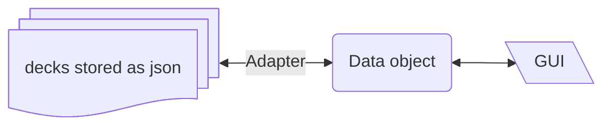

# My Anki

MyAnki is a personal project to develop a light app to study for exams through flashcards. It is not created to substitude [Anki](https://apps.ankiweb.net/), but to practice my python skills and achieving something helpful that I could use. Obviously, it is strongly inspired by the preovious mentioned app.

## Technologies used
- Python 3.13: as the main Programming Language in which is written the business logic
- PyQT: to build the HMI
- Pydantic: in order to load data and validate JSON-based structures

## Main architecture

## Functionality
### Must have
- [x] Normal question
- [x] True False question
- [ ] Combo box questions
- [x] Main window launcher
- [x] Custom card number exam
- [ ] question editor(edit, add, delete)
- [ ] Deck Creation
- [ ] Image in questions
- [ ] JSON exportation

### Nice to have
- [ ] Time to remember functionality
- [ ] Tag filtering
- [ ] Deck fusing
- [ ] Stopwatch / timer for the exam
- [ ] Exam result
- [ ] Repeat Failed
- [ ] Main window improvement
- [ ] Light / Dark theme
- [ ] Editable style / themes
    - Extract everyhing to css 
